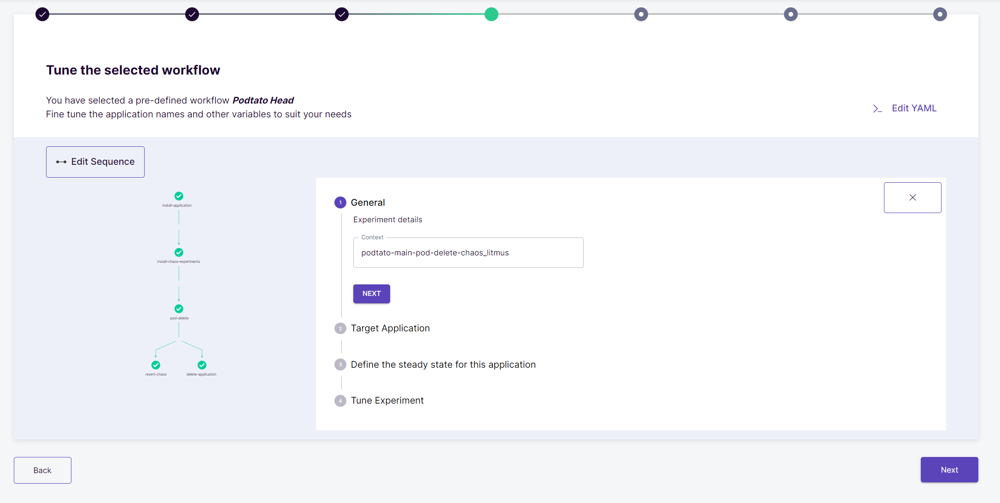
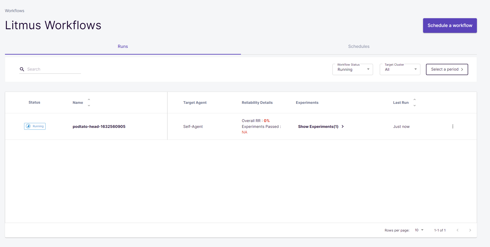

# Litmus Chaos demo

Chaos Engineering is the discipline of experimenting on a system in order to build confidence in the system’s capability to withstand turbulent conditions in production. This is very good detailed in [Principles Of Chaos Engineering](http://principlesofchaos.org/) website which I really recommend to read it.

In the market, there are currently many tools that ease us the task of "experimenting":

* [Chaos Monkey](https://github.com/Netflix/chaosmonkey) - A resiliency tool that helps applications tolerate random instance failures.
* [Gremlin Inc.](https://www.gremlin.com/) - Failure as a Service.
* [Chaos Toolkit](https://github.com/chaostoolkit/chaostoolkit) - A chaos engineering toolkit to help you build confidence in your software system.
* [Litmus Chaos](https://github.com/litmuschaos/litmus) - Framework for Kubernetes environments that enables users to run test suites, capture logs, generate reports and perform chaos tests.
* [Chaos Monkey for Spring Boot](https://codecentric.github.io/chaos-monkey-spring-boot/) - Injects latencies, exceptions, and terminations into Spring Boot applications

More tools can be found [here](https://github.com/dastergon/awesome-chaos-engineering).

---

However, the purpose of this project is to demonstrate how to run Chaos Engineering experiments using hte tool [Litmus Chaos](https://github.com/litmuschaos/litmus).

LitmusChaos is a Cloud-Native Chaos Engineering Framework with cross-cloud support. It is a CNCF Sandbox project with adoption across several organizations. Its mission is to help Kubernetes SREs and Developers to find weaknesses in both Non-Kubernetes as well as platforms and applications running on Kubernetes by providing a complete Chaos Engineering framework and associated Chaos Experiments.

In this demo, we are going to use the version [2.0](https://github.com/litmuschaos/litmus/releases/tag/2.0.0). Additionally, you can watch [this video](https://www.youtube.com/watch?v=nOTYIVP9lZY) for more details about the 2.0 biggest improvements.

We will perform 2 main experiments using *Litmus* in 2 different ways:

- *Getting started with Litmus ChaosCenter**: we will executed a predefined workflow using **Litmus ChaosCenter**, so we will play with Litmus and be familiarized with its great UI.
- *Overcoming to Chaos*: a simple predefined workflow launched by **Litmus ChaosCenter**, so you will be familiarized with its great UI.

## Environment preparation

### Requisites

You will need the following resources:

- Windows, OSX or Linux
- Docker.

### Kubernetes Installation

In case you need a Kubernetes cluster locally, I encourage to use [k3d](https://k3d.io/) is a lightweight wrapper to run [k3s](https://github.com/rancher/k3s) (Rancher Lab’s minimal Kubernetes distribution) in docker.

- [Install](https://k3d.io/v4.4.8/#quick-start) k3d.

- Create a k3d cluster with 3 master and 3 workers.

        ```bash
        k3d cluster create --agents 2 --servers 3
        ```

### Install Litmus Operator

- Create a namepsace for Litmus.

        ```bash
        kubectl create ns litmus
        ```

- Install Litmus.

        ```bash
        kubectl apply -n litmus -f https://litmuschaos.github.io/litmus/2.0.0/litmus-2.0.0.yaml
        ```

- Verifiy Litmus is running.

        ```bash
        kubectl get pods -n litmus
        ```

- Open port to Litmus ChaosCenter.

```
kubectl port-forward svc/litmusportal-frontend-service -n litmus 30000:9091 --address 0.0.0.0
```

- Access to [Litmus ChaosCenter](http://localhost:30000).

    - If using WSL+Docker, run:

            ```bash
            wslview http://$(hostname -I):30000
            ```

- We should be able to see the Login Page of Litmus ChaosCenter. The default credentials are ```admin``` and ```litmus```.


- By default we are assigned with a default project with Owner permissions.


## Experiment 1: Getting started with Litmus ChaosCenter

In this scenario we will getting started with Litmus and its UI called Litmus ChaosCenter. The steps are:

- Install and execute a pod-delete fault on the Potato Head Application.
- Visualize and analyze the chaos experiment.

### Selecting the Workflow

- Click on Schedule a Workflow from the ChaosCenter Homepage.


- Select Self Agent as the target ChaosAgent for Chaos Injection and click *Next*.


- Expand the first radio button and select "potato-head" from the list of Predefined Workflows and click *Next*.


- Now, we can see the workflow details where we can modify the name and description to suit our needs. Click *Next*.


### Understating a Workflow

Before, describe some concepts in order to understand what it is a workflow:

- **Chaos Workflow** is a set of different operations coupled together to achieve desired chaos impact on a Kubernetes Cluster.
- A workflow consist of several step like application deployment, install-chaos-experiments or the actual experiments.
- A experiment is made of:
    - The proper experiment itself that perform the chaos in the system. The list of types can be found [here](https://github.com/litmuschaos/chaos-charts).
    - Experiment Tunables Specification that manage the experiment execution.
    - Probes which are pluggable checks that determine the verdict of the experiment.


Now, continue with the demo:

- In "Tune workflow" step, we will be able to see the sequence of the experiment and change to our needs.


- If we click in "Edit Sequence", we must see the DAG corresponding to the sequence of the experiment and even modify. Just let as is and click *Save changes*.


- Back again, click in "podtato-main-pod-delete-chaos_litmus", we may edit the the experiment. Just let as is and click *Next*.



- Now, it is possible to edit the *target application* of our "delete-pod" experiment selecting the appropriate labels or namespace. Just let as is and click *Next*.


- Next Step is configure probes, it is possible to edit the existen *check-podtato-main-access-url* that make a simple HTTP request or add new ones. Just let as is and click *Next*.


- Last step, you can *tune the experiment* changing the duration of the experiment and other parameters. Just let as is and click *Next*.


- After configuring the workflow sequence, if we click in "Edit YAML", we will get the corresponding YAML with the Litmus Kubernetes Custom Resources for this the experiment and even modify them. Just let as is and click *Save changes*.


- Finally, click *Next*.

### Schedule the Workflow

- In "Reliability score" step, we can adjust the weights of the experiments in the Litmus workflow. However, it is not very usefull for us right now. Click *Next*.


- At this point, we will be able to schedule the workflow. In our case, just set *Schedule Now* and click *Next*.


- Finally, a summary of the workflow is shown. Verify it and click *Next*.


### Checking results

- Go to "Litmus Workflows" where we can see our workflow and its current status. Click in the workflow.



- Let open the shell again and see what has happened.

        ```
        kubectl get pods -n litmus | grep bank
        ```

- It must show that there a pod created by deployment/podtato-main has been deleted.

        ```bash
        podtato-right-leg-68bb97548f-l6fz4          1/1     Running       0          4m57s
        podtato-hats-5f6c4d9ff-q5dn2                1/1     Running       0          4m59s
        podtato-right-arm-98bdff545-r9d9p           1/1     Running       0          4m56s
        podtato-left-leg-5544c7c88c-4g69t           1/1     Running       0          4m59s
        podtato-left-arm-647c44c49f-llm4s           1/1     Running       0          4m58s
        podtato-hats-new-787797c7fd-jhjsh           1/1     Running       0          4m47s
        podtato-main-7bcb959bd8-pmtx9               1/1     Running       0          4m59s
        podtato-head-1632560905-2464361453          0/2     Completed     0          5m7s
        podtato-head-1632560905-365914815           0/2     Completed     0          3m25s
        podtato-head-1632560905-2013300608          2/2     Running       0          114s
        podtato-main-pod-delete-chaos4pxcs-runner   1/1     Running       0          66s
        podtato-main-7bcb959bd8-5rlcc               0/1     Running       0          8s
        podtato-main-7bcb959bd8-zjdgc               0/1     Terminating   0          4m59s
        ```

- Wait until the workflow is completed


- If we click in the pod-delete step, the logs of the experiment will appear.


### Summary experiment 1

In this scenario we have seen that:

- Litmus contains a great and simple UI.
- How to execute and monitor a workflow.

## Experiment 2: Overcoming to Chaos

In this scenario we will perform chaos into a simple application and make it more resilient. The steps are:

- Install an application.
- Create and perform a workflow so the application will fail.
- Modify the application to be more resilient.
- Run again the experiment in order to check its new resilience.

### Install the application

- Create test namespace.

        ```bash
        kubectl create ns test
        ```

- Create a deployment for a ngnix server with 1 replica.

        ```bash
        kubectl create deployment -n test --image=nginx --port 80 nginx --replicas=1
        ```

- Expose the server creating a service.

        ```bash
        kubectl expose deployment -n test nginx --port=80 --target-port=80 --cluster-ip=''
        ```

- Verify the service nginx is running.

        ```bash
        kubectl get deployment,pod,svc -n test

        ---
        NAME                    READY   UP-TO-DATE   AVAILABLE   AGE
        deployment.apps/nginx   1/1     1            1           104s

        NAME                         READY   STATUS    RESTARTS   AGE
        pod/nginx-7848d4b86f-frd6p   1/1     Running   0          104s

        NAME            TYPE        CLUSTER-IP      EXTERNAL-IP   PORT(S)   AGE
        service/nginx   ClusterIP   10.43.116.253   <none>        80/TCP    72s
        ```

        ```bash
        kubectl run -n test test-ngnix --image=busybox --rm --restart=Never -it -- sh -c "wget -O- http://nginx.test.svc.cluster.local:80 --timeout 3"

        ---
        writing to stdout
        <!DOCTYPE html>
        <html>
        <head>
        <title>Welcome to nginx!</title>
        <style>
        html { color-scheme: light dark; }
        body { width: 35em; margin: 0 auto;
        font-family: Tahoma, Verdana, Arial, sans-serif; }
        </style>
        </head>
        <body>
        <h1>Welcome to nginx!</h1>
        <p>If you see this page, the nginx web server is successfully installed and
        working. Further configuration is required.</p>

        <p>For online documentation and support please refer to
        <a href="http://nginx.org/">nginx.org</a>.<br/>
        Commercial support is available at
        <a href="http://nginx.com/">nginx.com</a>.</p>

        <p><em>Thank you for using nginx.</em></p>
        </body>
        </html>
        -                    100% |********************************|   615  0:00:00 ETA
        written to stdout
        pod "test-ngnix" deleted
        ```

### Perform Chaos

Next step is to create and run a workflow in Litmus to test our application:

- Create a new workflow using experiments from ChaosHub.
- Set name and description.
- Add a new experiment of type "generic/pod-delete".
- Edit the experiment.
    - Set appns = test  .
    - Add new Probe and set:.
        - Probe Name: Health Check
        - Probe Type: http
        - Timeout(sec): 1
        - Interval(sec): 1
        - Retry(times): 5
        - URL: http://nginx.test.svc.cluster.local
        - Method: GET
        - Criteria: ==
        - Response Code: 200
    - The rest of parameters as default.
- Schedule now the workflow and wait for the results.

### Checking results

Now, it is time to check the result and check why the application has failed the experiment.

- In the workflow Runs table, the run has failed.
- The explanation is very simple:
    - The application consist of a nginx deployed in a deployment with 1 replica.
    - The experiment delete ones of the pod of that deployment.
    - Due to that there were only one replica the HTTP probes failed because no more ngnix instances were available.


### Improving the resilience of the application

Now, it is time to improve the application design.

- This will be very simple, just modify the deployment to have more replicas:

        ```bash
        kubectl patch deployment -n test nginx -p '{"spec":{"replicas":3}}'
        ```

- Check that now there are more than one pod running nginx.

        ```bash
        kubectl get pod -n test

        ---
        NAME                     READY   STATUS    RESTARTS   AGE
        nginx-7848d4b86f-k2psj   1/1     Running   0          10m
        nginx-7848d4b86f-j67mg   1/1     Running   0          14s
        nginx-7848d4b86f-zs7qd   1/1     Running   0          14s
        ```

### Check new resilience

Finally, we must ensure that the application now is able to work correctly in case of container failures.

Just re-run the workflow again:

- In the workflow Schedules table, click in the 3 dots in the workflow we have created before and press *Rerun schedule*.
- Wait for the results.


### Summary experiment 2

In this scenario we have seen that:

- Although we design an application to be resilient, it can fail.
- Litmus can detect holes in our architectures.
- How to perform the Chaos Engineering cycle.

